# Archalley Newsletter System - Administrator Guide

## Table of Contents
1. [Getting Started](#getting-started)
2. [Managing Email Lists](#managing-email-lists)
3. [Creating & Sending Newsletters](#creating--sending-newsletters)
4. [Managing Ad Banners](#managing-ad-banners)
5. [Viewing Analytics](#viewing-analytics)
6. [Common Tasks](#common-tasks)
7. [Getting Help](#getting-help)

---

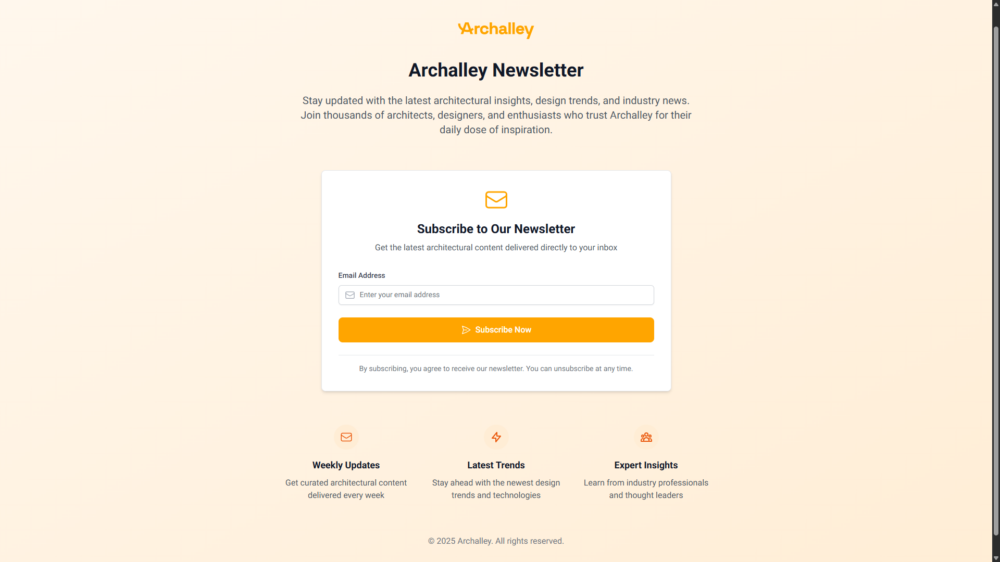

## What is the Archalley Newsletter System?

The Archalley Newsletter System helps you send beautiful email newsletters to your subscribers. The system automatically pulls the latest blog posts from the Archalley website and lets you easily create and send newsletters.

**What you can do:**
- Create and manage email subscriber lists
- Send newsletters with the latest blog posts
- Add promotional banners to newsletters
- Track how many people open and click your emails
- Schedule newsletters to send later

## Getting Started

### How to Log In

1. Go to the newsletter admin website
2. Click the **"Sign in with Google"** button
3. Use your authorized Google account to sign in

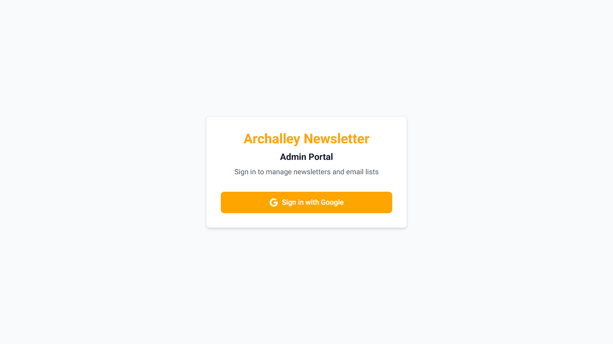

**Important:** Only authorized Google accounts can access the system. If you get an "Access Denied" error, contact your system administrator.

### Understanding the Dashboard

After logging in, you'll see the main dashboard showing:
- **Email Lists**: How many subscriber lists you have
- **Active Subscribers**: Total number of people who will receive emails
- **Total Newsletters**: All newsletters you've created
- **Sent Newsletters**: Newsletters that have been successfully sent

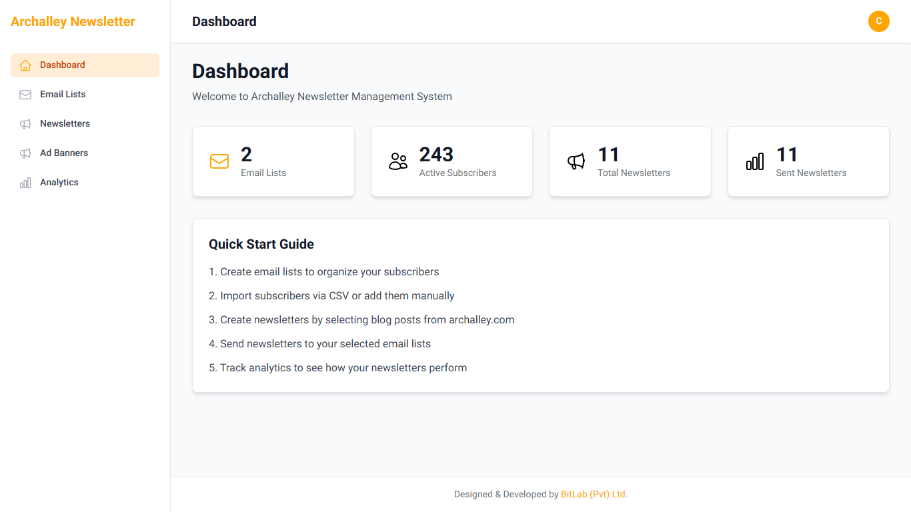

### Navigation Menu

Use the menu on the left to access different sections:
- **Dashboard**: Overview of your newsletter system
- **Email Lists**: Manage your subscriber lists
- **Newsletters**: Create and send newsletters
- **Ad Banners**: Manage promotional banners
- **Analytics**: See how your newsletters are performing

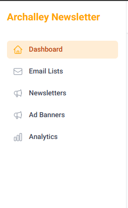

---

## Managing Email Lists

Email lists help you organize your subscribers. You might have different lists for different types of content or audiences.

### How to Create a New Email List

1. Click **"Email Lists"** in the left menu
2. Click the **"New Email List"** button
3. Fill in the information:
   - **Name**: Give your list a clear name (e.g., "Weekly Newsletter Subscribers")
   - **Description**: Add a brief description (optional)
4. Click **"Save"**

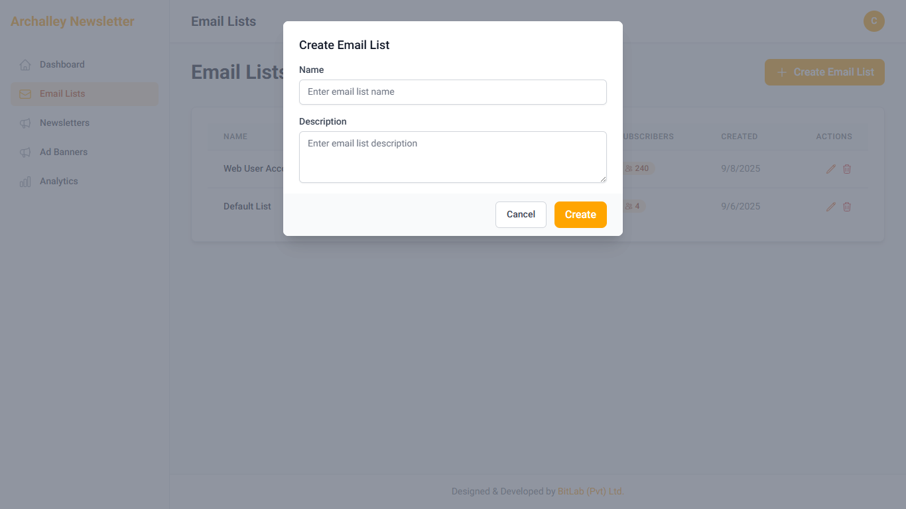

### How to Add Subscribers to Your Lists

#### Adding One Subscriber at a Time

1. Go to **Email Lists**
2. Click on the name of the list you want to add to
3. Click **"Add Subscriber"**
4. Type in the email address
5. Click **"Add"**

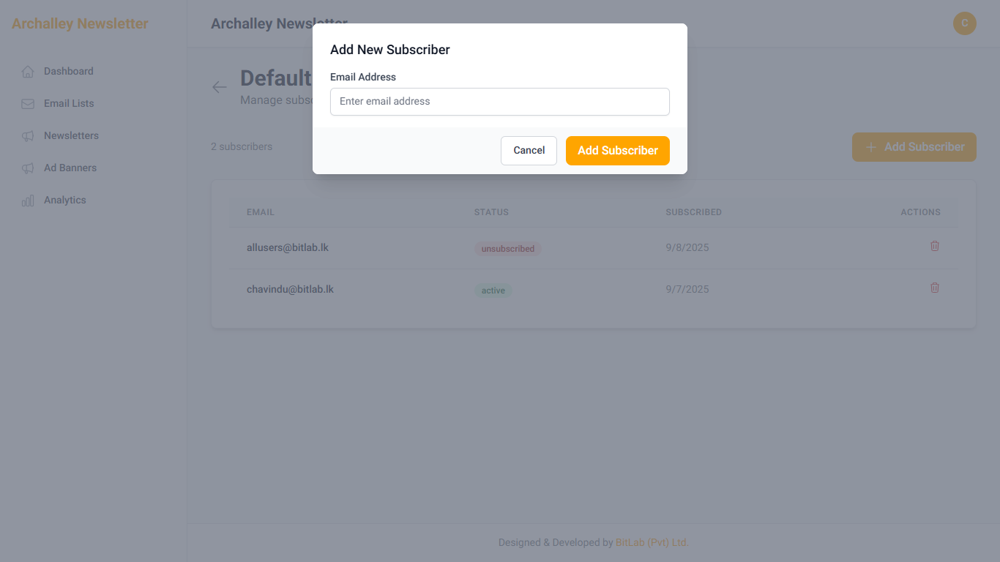

### Understanding Subscriber Status

Each subscriber has a status:
- **Active**: They will receive your newsletters
- **Unsubscribed**: They opted out and won't receive emails
- **Bounced**: Their email address doesn't work

You can see and change these statuses from your subscriber list.

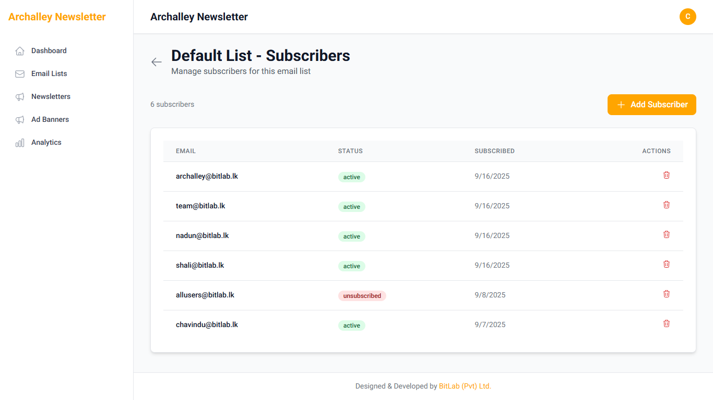

## Creating & Sending Newsletters

Creating newsletters is easy! The system automatically pulls the latest blog posts from the Archalley website, and you just need to choose which ones to include.

### How to Create a New Newsletter

1. Click **"Newsletters"** in the left menu
2. Click **"New Newsletter"**
3. Give your newsletter a title (e.g., "Weekly Update - January 2024")
4. Choose which blog posts to include
5. Select which email lists to send to
6. Choose when to send it
7. Click **"Save & Send"** or **"Schedule"**

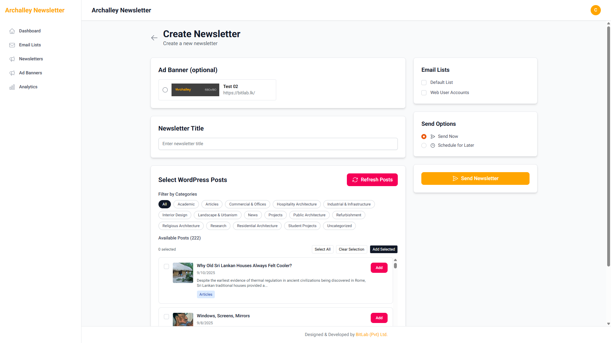

### Choosing Blog Posts for Your Newsletter

The system shows you all the latest posts from the Archalley website:

#### Using Category Filters
- Click on category buttons to see only posts from specific topics
- This helps you find the right posts faster

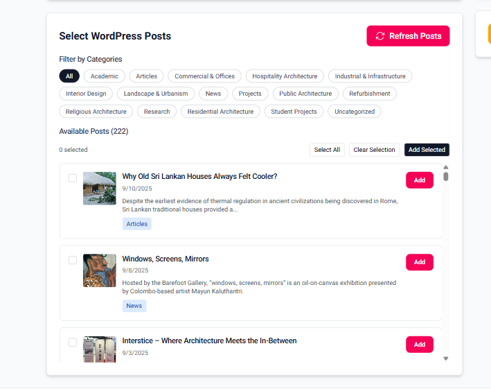

#### Selecting Posts
1. Look through the available blog posts
2. Click the checkbox next to posts you want to include
3. Selected posts will appear in a "Selected Posts" section
4. You can drag posts to reorder them

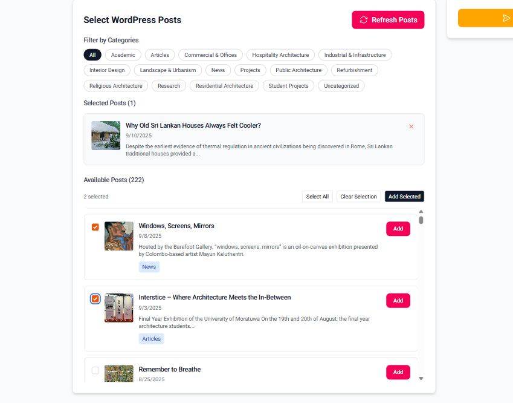

**Tip:** Choose 3-5 high-quality posts for the best newsletter experience.

### Choosing Who Gets Your Newsletter

1. In the newsletter form, you'll see a list of your email lists
2. Check the boxes next to the lists you want to send to
3. You can select multiple lists - the system won't send duplicates to people on multiple lists

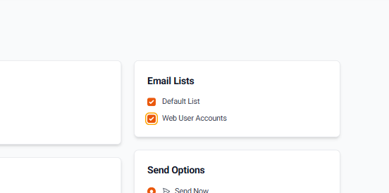

### When to Send Your Newsletter

You have two options:

#### Send Right Now
- Select "Send Now"
- Your newsletter will be sent immediately after you save it

#### Schedule for Later
- Select "Schedule"
- Pick a date and time
- Your newsletter will be sent automatically at that time

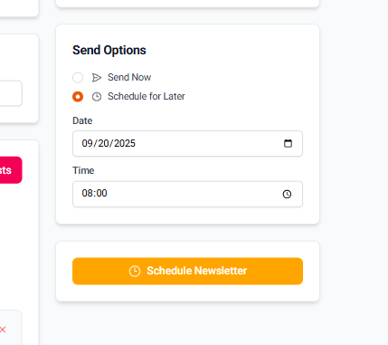

### Managing Your Newsletters

After creating newsletters, you can see them all in the Newsletters section:

- **Draft**: Not sent yet (you can still edit these)
- **Scheduled**: Will be sent at the time you chose
- **Sent**: Already delivered to subscribers

#### What You Can Do:
- **Edit**: Change draft newsletters before sending
- **View**: See what a sent newsletter looked like
- **Resend**: Send the same newsletter again
- **Delete**: Remove a newsletter (be careful!)

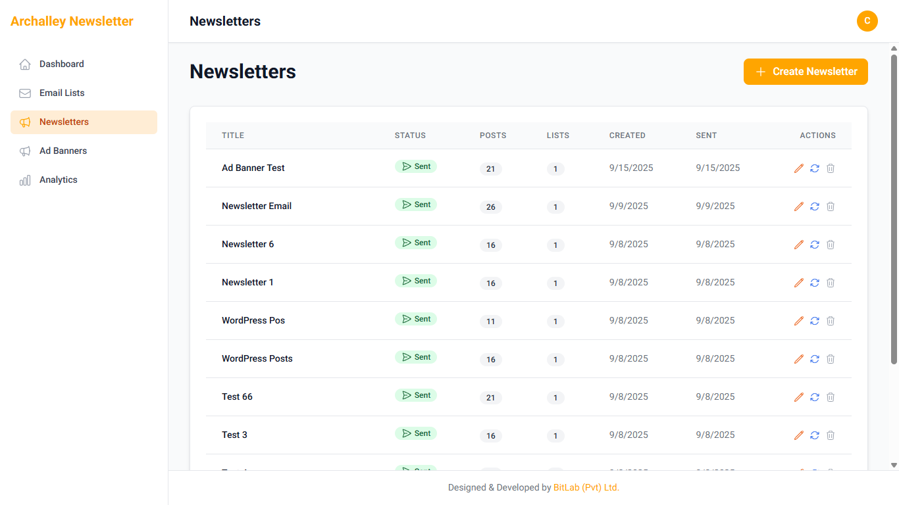

### What Goes in Your Newsletter

Your newsletters automatically include:
1. **Archalley header** with logo
2. **The blog posts you selected** with images and summaries
3. **Ad banner** (if you added one)
4. **Footer** with unsubscribe links and social media

---

## Managing Ad Banners

Ad banners are promotional images that appear in your newsletters. They can advertise products, services, or special offers.

### How to Create a New Ad Banner

1. Click **"Ad Banners"** in the left menu
2. Click **"New Ad Banner"**
3. Fill in the information:
   - **Company Name**: Name of the advertiser
   - **Website URL**: Where people go when they click the banner
   - **Description**: Brief description of the ad
   - **Status**: Choose "Active" to use it, "Inactive" to hide it
   - **Start Date**: When the ad should start showing (optional)
   - **End Date**: When the ad should stop showing (optional)
4. Upload your banner image
5. Click **"Save"**

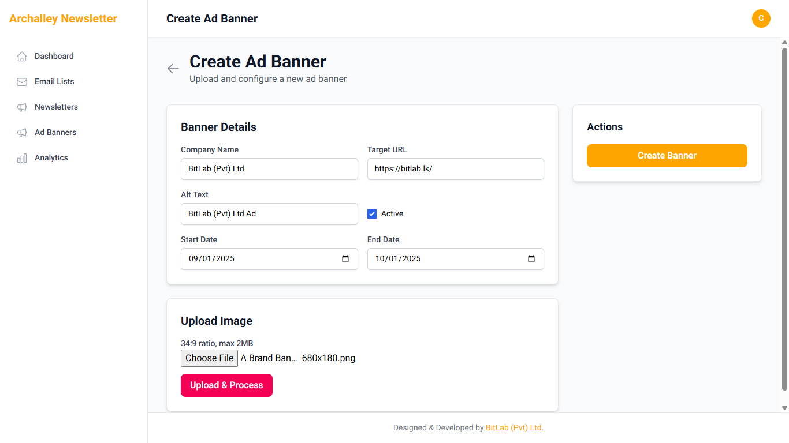

### Image Requirements

When uploading banner images:
- **File size**: Must be smaller than 2MB
- **File types**: JPG, PNG, WebP, or GIF files work
- **Image shape**: The system will automatically resize your image to the right shape

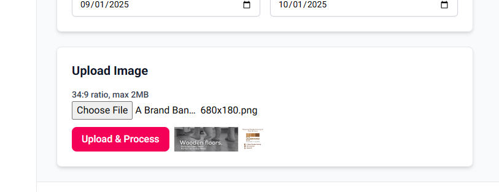

### Managing Your Ad Banners

You can see all your ad banners in the Ad Banners section:

- **Active**: These banners can be used in newsletters
- **Inactive**: These banners are hidden and won't appear in newsletter options
- **Expired**: Banners that have passed their end date

#### What You Can Do:
- **Edit**: Change banner details or upload a new image
- **View**: See how the banner looks
- **Turn On/Off**: Activate or deactivate banners
- **Delete**: Remove banners you no longer need

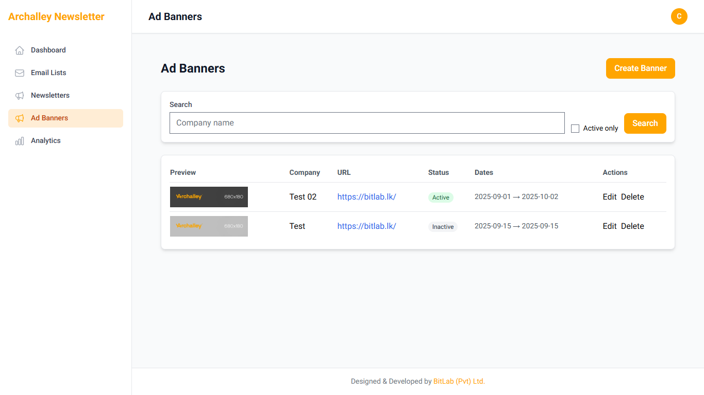

### Adding Banners to Your Newsletters

When creating a newsletter:
1. Look for the "Ad Banner" section
2. Choose from your active banners
3. The banner will appear in your newsletter between the blog posts and footer

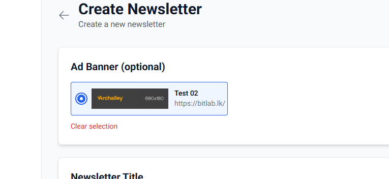

## Viewing Analytics

Analytics help you understand how well your newsletters are performing. You can see how many people opened your emails and clicked on links.

### How to View Your Analytics

1. Click **"Analytics"** in the left menu
2. You'll see an overview of all your newsletter performance

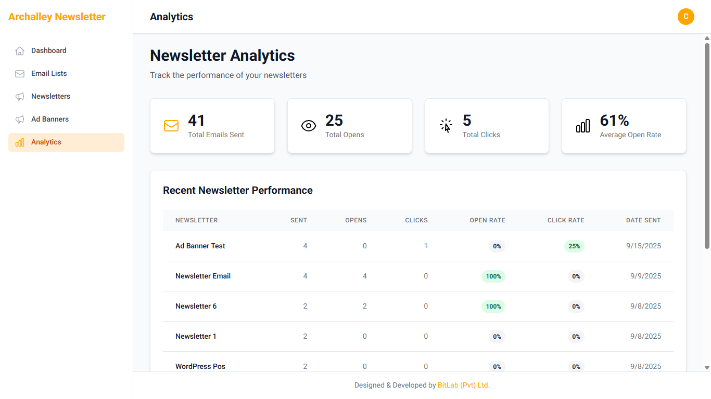

### Understanding Your Numbers

#### Main Statistics
- **Total Emails Sent**: How many emails you've sent overall
- **Total Opens**: How many times people opened your emails
- **Total Clicks**: How many times people clicked links in your emails
- **Average Open Rate**: What percentage of people typically open your emails

#### Individual Newsletter Performance
For each newsletter, you can see:
- **Open Rate**: What percentage of people opened this specific newsletter
- **Click Rate**: What percentage clicked on links
- **Send Date**: When you sent the newsletter

### What Makes Good Performance?

- **Open Rate**: 20% or higher is good (this means 1 in 5 people opened your email)
- **Click Rate**: 2-5% is typical (this means people are interested in your content)
- **Growing Numbers**: More subscribers and consistent engagement over time

### Tips to Improve Your Results

- **Write catchy subject lines**: This helps more people open your emails
- **Send at good times**: Try different days and times to see what works best
- **Pick interesting content**: Choose blog posts your audience will find valuable
- **Don't send too often**: Once or twice a week is usually enough

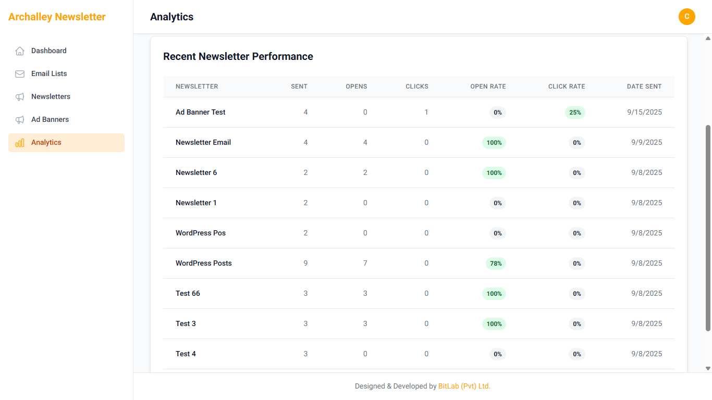

---

## Common Tasks

### Weekly Newsletter Routine

Here's a typical workflow for sending weekly newsletters:

1. **Check for New Blog Posts**: The system automatically gets new posts from the Archalley website
2. **Create Newsletter**: Click "New Newsletter" and give it a title
3. **Select Posts**: Choose 3-5 interesting blog posts from the past week
4. **Choose Lists**: Select which subscriber lists should receive it
5. **Add Banner**: Pick an ad banner if you have one active
6. **Send or Schedule**: Either send immediately or schedule for a specific time

### Monthly List Maintenance

Once a month, clean up your subscriber lists:

1. **Check Bounced Emails**: Remove email addresses that don't work
2. **Review Unsubscribes**: See if there are patterns in who's unsubscribing
3. **Add New Subscribers**: Import any new email addresses you've collected

### Preparing for Campaigns

When you have a special promotion or announcement:

1. **Create Ad Banner**: Make a banner for your promotion
2. **Create Special Newsletter**: Focus on your announcement
3. **Choose Target Lists**: Send to your most engaged subscribers first
4. **Monitor Results**: Check open and click rates to see how it performed

---

## Getting Help

### If You Can't Log In

- Make sure you're using the correct Google account
- If you get "Access Denied," contact your system administrator
- Try clearing your browser cookies and trying again

### If Newsletters Aren't Sending

- Check that you selected at least one email list
- Make sure your email lists have active subscribers
- Wait a few minutes - large lists can take time to send

### If You Don't See New Blog Posts

- The system updates automatically, but it might take a few hours
- Try refreshing your browser page
- Contact your system administrator if posts are missing for more than a day

### If Analytics Look Wrong

- Analytics update within a few hours of sending
- Very low open rates might mean emails went to spam folders
- Check that your subject lines aren't too promotional

### Getting Technical Help

If you encounter technical problems:

1. **Try refreshing the page** - this fixes many temporary issues
2. **Check your internet connection**
3. **Try logging out and back in**
4. **Contact your system administrator** with details about what you were trying to do

### Best Practices for Success

#### Writing Good Subject Lines
- Keep them short (under 50 characters)
- Make them interesting but not clickbait-y
- Avoid words like "FREE" or "URGENT" that trigger spam filters
- Include the date or issue number for regular newsletters

#### Choosing the Right Posts
- Pick posts that are recent and relevant
- Include a mix of topics if possible
- Choose posts with good images
- Avoid too many posts - 3-5 is usually perfect

#### Timing Your Newsletters
- Tuesday-Thursday usually work best
- Mid-morning (10 AM) or early afternoon (2 PM) are good times
- Avoid Mondays (too busy) and Fridays (people are checking out)
- Be consistent - if you send weekly, pick the same day each week

#### Growing Your Subscriber List
- Always ask for permission before adding someone
- Make it easy for people to subscribe on your website
- Offer something valuable in exchange for their email
- Never buy email lists - this hurts your reputation

---

*Need help with something not covered here? Contact your system administrator or technical support team.*
